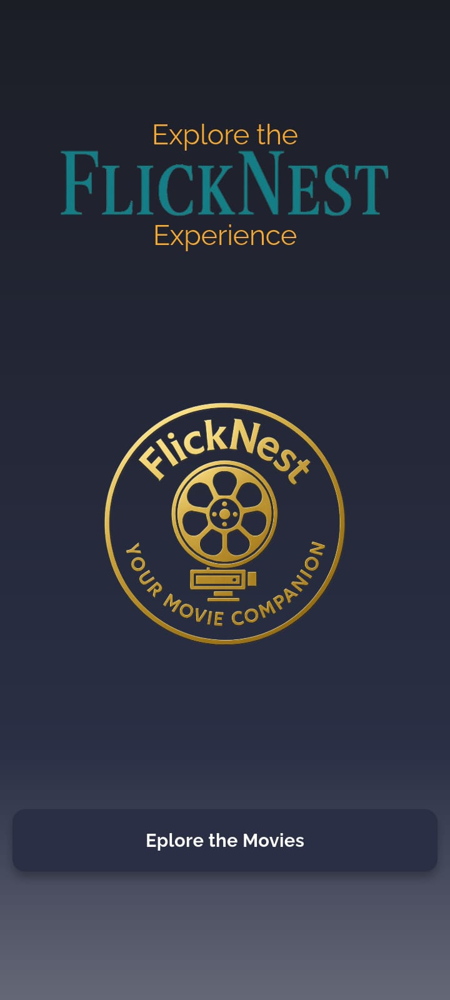
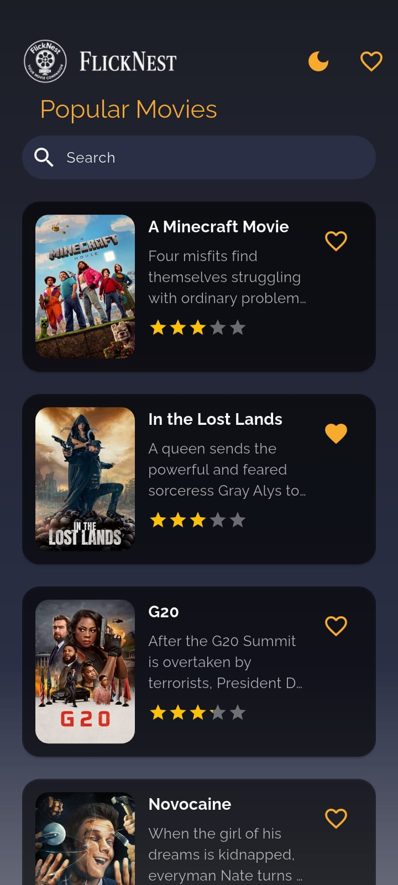
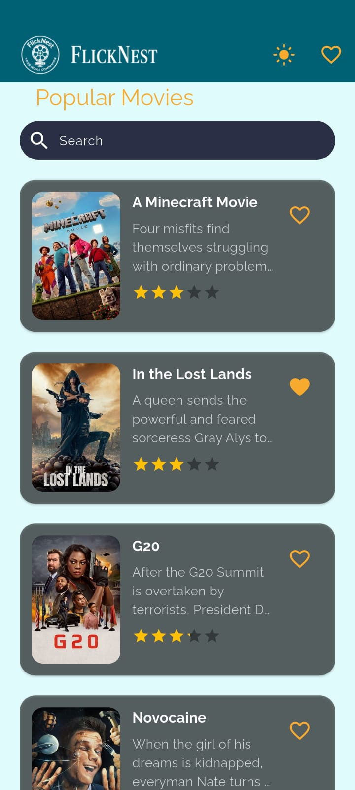
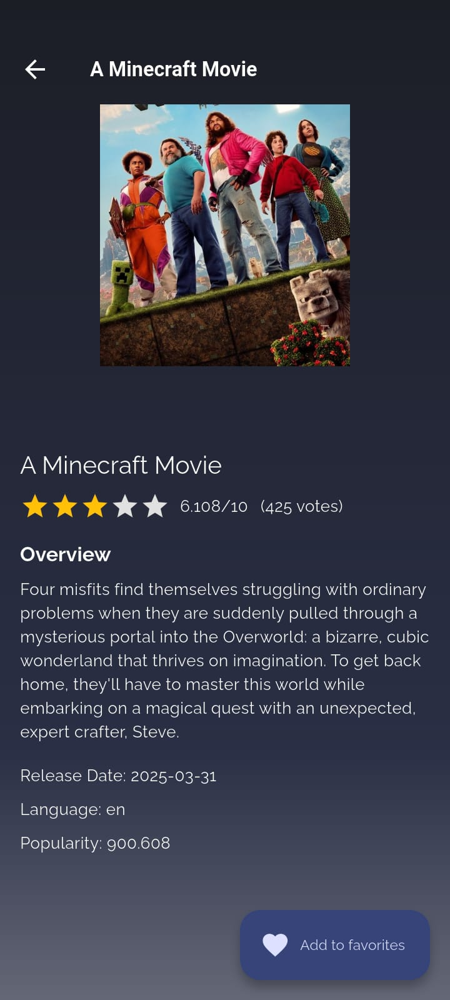
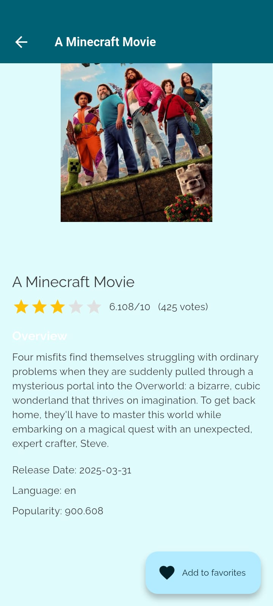
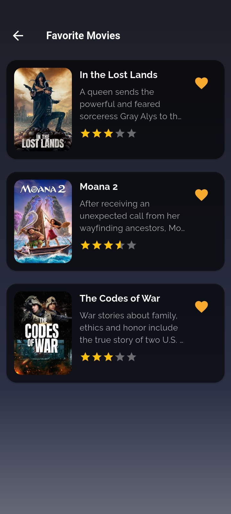
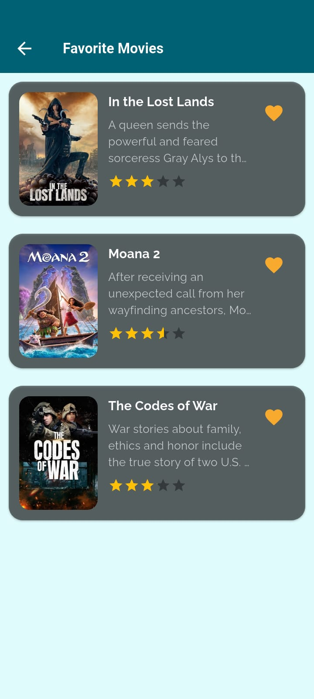

# FlickNest

FlickNest is a Flutter application that fetches popular movies from the [TMDb API](https://www.themoviedb.org/documentation/api) and showcases them with a clean, responsive UI. The app supports infinite pagination, offline caching, favorites management, and search functionality. It was built as an assessment project showcasing modern Flutter architecture with state management using Provider.

---

## Demo
<video controls width="640">
  <source src="screenshots/demo.mp4" type="video/mp4">
  Your browser does not support the video tag.
</video>
<p><a href="screenshots/demo.mp4" target="_blank">Click here to view the demo video in your browser</a></p>


## Table of Contents

- [Features](#features)
- [Project Architecture](#project-architecture)
- [State Management](#state-management)
- [Setup Instructions](#setup-instructions)
- [Screenshots](#screenshots)
- [Dependencies](#dependencies)
- [License](#license)

---

## Features

- **Popular Movies:** Browse popular movies fetched from TMDb with infinite scrolling.
- **Offline Caching:** Movie data is cached using SharedPreferences so users can view the content offline.
- **Favorites:** Mark and persist favorite movies locally, even after the app restarts.
- **Search:** Real-time search functionality that queries the TMDb search endpoint.
- **Clean UI:** Responsive design with polished widgets and custom themes.
- **Navigation:** Seamless navigation using [go_router](https://pub.dev/packages/go_router) with named routes.

---

## Project Architecture

FlickNest follows a clean architecture inspired by the MVVM pattern, with modular separation for ease of maintenance and scalability.

### Directory Structure

```plaintext
lib/
├── core/
│   ├── bootstrap/            # Bootstrapping related classes
│   ├── models/               # Data models (e.g., Movie)
│   ├── providers/            # Provider classes (e.g., MoviesProvider)
│   ├── routes/               # Route configuration using go_router
│   ├── services/             # API services and local storage (SharedPreferences)
│   ├── utils/                # Utility classes and constants
│   └── widgets/              # Reusable widget components (e.g., MovieCard)
├── view/
│   ├── 00_splash_screen/     # Splash screen implementation
│   ├── 01_onboarding_screen/ # Onboarding screen implementation
│   ├── 02_home_screen/       # Home screen for popular movies
│   ├── 03_favorite_screen/   # Screen to display favorite movies
│   └── 04_movie_details_screen/ # Detailed movie information screen
├── app.dart                  # Core app configuration
└── main.dart                 # Application entry point
```

### Screenshots and Videos Folder

The `screenshots` folder (located at the root) contains images and videos demonstrating the app's UI, showcasing all key screens:

- **Splash Screen**
- **Onboarding Screen**
- **Home Screen (Popular Movies)**
- **Favorite Screen**
- **Movie Details Screen**

---

## State Management

FlickNest uses **Provider** for state management, which provides a lightweight yet powerful way to manage application state and business logic. The `MoviesProvider` class handles:

- Fetching and caching popular movies.
- Toggling and caching favorite movies.
- Managing search results and loading states.
- Updating the UI through ChangeNotifier notifications.

---

## Setup Instructions

Follow these steps to set up and run the project locally:

1. **Clone the Repository**

   ```bash
   git clone https://github.com/ubaidxdev/flicknest.git
   cd flicknest
   ```

2. **Install Dependencies**

   Make sure you have [Flutter](https://flutter.dev/docs/get-started/install) installed, then run:

   ```bash
   flutter pub get
   ```

3. **Configure the TMDb API Key**

   Create or update a configuration file (e.g., [app_constants.dart](lib/core/utils/app_constants.dart)) with your TMDb API key:

   ```dart
    static const String apiKey = 'YOUR_TMDb_API_KEY'; // Replace with your actual API key
    static const String accessToken = 'YOUR_ACCESS_TOKEN'; // Replace with your actual access token
   ```

4. **Initialize SharedPreferences**

   In your `main.dart` (or bootstrap file), ensure the `StorageService` is initialized before running the app:

   ```dart
   void main() async {
     WidgetsFlutterBinding.ensureInitialized();
     await StorageService.instance.init();

     runApp(
       MultiProvider(
         providers: [
           ChangeNotifierProvider(create: (_) => MoviesProvider()..loadCachedData()),
         ],
         child: FlickNestApp(),
       ),
     );
   }
   ```

5. **Run the App**

   Use the command below to run on your emulator or connected device:

   ```bash
   flutter run
   ```

---

## Screenshots

Below is an overview of the key screens in the app. (Ensure that your `screenshots` folder contains the following images: `splash.png`, `onboarding.png`, `home.png`, `favorite.png`, `movie_details.png`.)

| Splash Screen                                  | Onboarding Screen                                      |
| ---------------------------------------------- | ------------------------------------------------------ |
|  |  |

| Home Screen (Popular Movies)               | Home Screen Light                               |
| ------------------------------------------ | ----------------------------------------------- |
|  |  |

| Movie Details Screen                                   | Movie Details Screen                                        |
| ------------------------------------------------------ | ----------------------------------------------------------- |
|  |  |

| Favorite Screen                                    | Favorite Screen                                         |
| -------------------------------------------------- | ------------------------------------------------------- |
|  |  |

---

## Dependencies

- **[Provider](https://pub.dev/packages/provider):** State management.
- **[go_router](https://pub.dev/packages/go_router):** Navigation with named routes.
- **[Dio](https://pub.dev/packages/dio):** HTTP client for API requests.
- **[Shared Preferences](https://pub.dev/packages/shared_preferences):** Local caching and persistence.
- **[Cached Network Image Plus](https://pub.dev/packages/cached_network_image_plus):** Efficient image loading and caching.
- **[Flutter Rating Bar](https://pub.dev/packages/flutter_rating_bar):** Display movie ratings.
- **[Shimmer](https://pub.dev/packages/shimmer):** Loading placeholders.

See the `pubspec.yaml` for the full list of dependencies.

---

## License

This project is licensed under the MIT License.

```text
MIT License

Copyright (c) 2025 Ubaid Ullah

Permission is hereby granted, free of charge, to any person obtaining a copy
of this software and associated documentation files (the "Software"), to deal
in the Software without restriction, including without limitation the rights
to use, copy, modify, merge, publish, distribute, sublicense, and/or sell
copies of the Software, and to permit persons to whom the Software is
furnished to do so, subject to the following conditions:

THE SOFTWARE IS PROVIDED "AS IS", WITHOUT WARRANTY OF ANY KIND, EXPRESS OR
IMPLIED, INCLUDING BUT NOT LIMITED TO THE WARRANTIES OF MERCHANTABILITY,
FITNESS FOR A PARTICULAR PURPOSE AND NONINFRINGEMENT. IN NO EVENT SHALL THE
AUTHORS OR COPYRIGHT HOLDERS BE LIABLE FOR ANY CLAIM, DAMAGES OR OTHER
LIABILITY, WHETHER IN AN ACTION OF CONTRACT, TORT OR OTHERWISE, ARISING FROM,
OUT OF OR IN CONNECTION WITH THE SOFTWARE OR THE USE OR OTHER DEALINGS IN THE
SOFTWARE.
```

---

## Author

**Ubaud Ullah**

[GitHub](https://github.com/ubaidxdev) • [LinkedIn](https://linkedin.com/in/ubaidxdev) • [Email](mailto:ubaidxdev@gmail.com)

---
